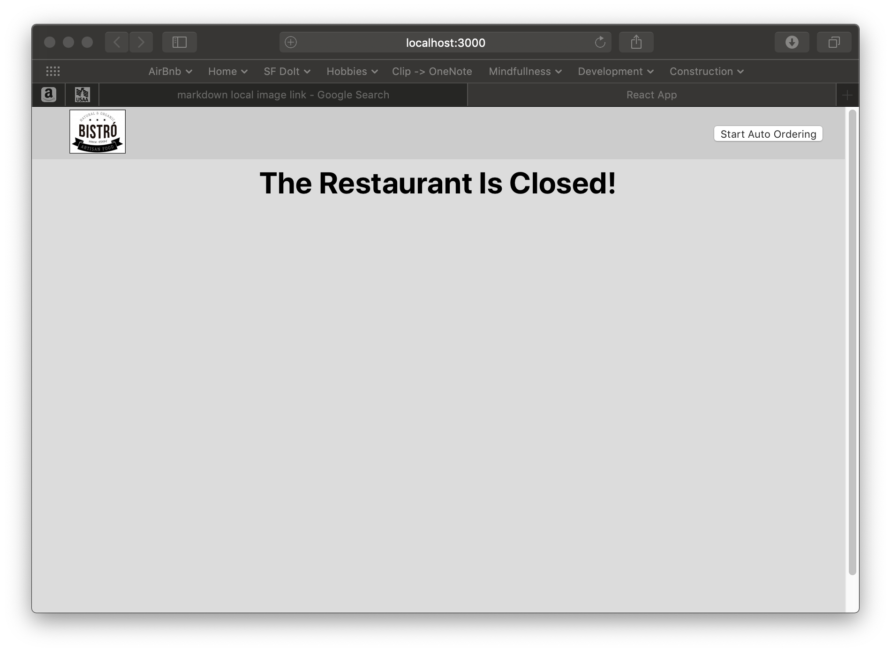
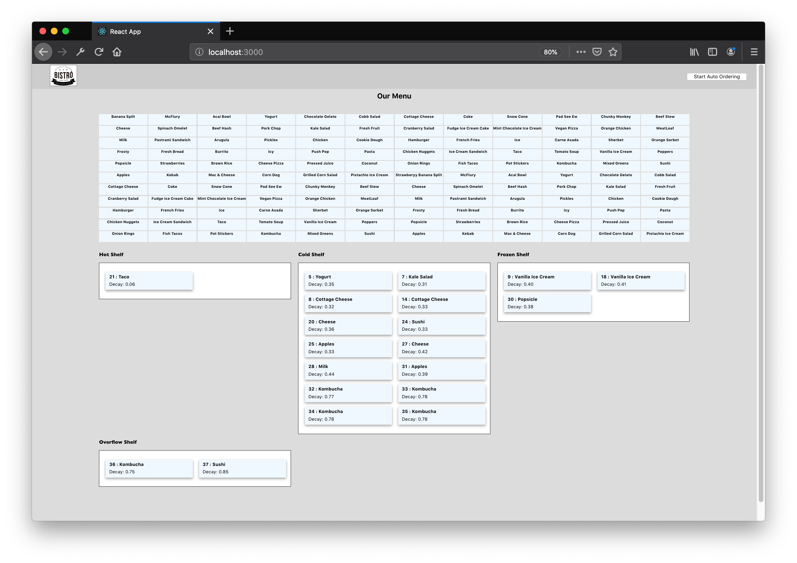

# Welcome

Thank you for checking out my "Bistro!" restaurant and order processing challenge!  There are two main components delivered in this challenge - a server side piece written in Java (with Spring as web service engine) and a client-side web application written in React / Javascript.  Note that the client side is by no means a professionally developed front end - but it's very useful for adhoc testing and a tool that can be used to visualize the workings of the system.

## Server Code Specifics
As mentioned above, the server is written in Java with Spring as the servlet/web server engine.  This is a maven project so please do the following in the top-level folder to download and install all dependencies you'll need:

#### $ mvn dependency:tree

Once dependencies are downloaded, you can do the following to start the server:

#### $ mvn spring-boot:run

This _should_ run the server on port 8000.  You should see the following displayed on the terminal after running this command:

2019-08-19 15:30:36.880  INFO 35306 --- [  restartedMain] com.redtail.csschallenge.CSSApplication  : Starting CSSApplication on ...

com.redtail.csschallenge.CSSApplication  : Started CSSApplication in 4.674 seconds (JVM running for 5.366)
Read 67 items on the menu
The Bistro! is now taking orders!

## Web Frontend Specifics

The frontend is a React UI (Javascript / JSX) that needs to run on port 3000 (if running on the same machine as the server).  This is because the CORS headers specify only this localhost port to accept requests from same host.  This is an 'npm' based project and there's several dependencies that must be downloaded and installed before running.  This is done using the following npm command from the 'frontend' directory included with this package:

#### $ cd frontend
#### $ npm update

Once that's finished, bringing up the UI is easily done using npm.  This should automatically launch a browser - but if not just browse to http://localhost:3000.

#### $ npm start

## Running the Bistro!

When you first launch the Bistro! UI, a request is sent to the restaurant to obtain its current state.  If the restaurant is closed (currently only when the backend is not running), you'll see the following:

In this state, the UI code will periodically poll the backend until it receives a response, after which the UI will be populated with both the restauran'ts Menu and the all of the shelve's current order information.

The Menu is interactive.  To order an item, just hover over the item you'd like and click.  It won't be immediately obvious that the item has been ordered, but it'll eventuall show up on the correct shelf.

To start auto ordering (using the Poisson distribution of 3.5 mean orders / second), press button on the top right of the UI ("Start Auto Ordering").  You'll see the shelves filling up fast as in the following image:

By default, I've increased the traffic delay for drivers.  I did this so you can see both the overflow shelf filling up and see orders being put into the trash (I don't have a trash bin, but you can see this in the server's console logs).  To modify the behavior back to the values in the specification, change the two parameters in csschallenge/DriverFactory.java: 

    private static final int MIN_TRAFFIC_DELAY = 2;

    private static final int MAX_TRAFFIC_DELAY = 10;

